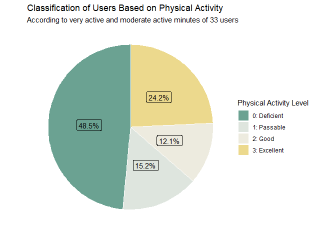

bellabeat-case-study
================
Elaine
2023-06-11

# Business Task

The Bellabeat company, a high-tech manufacturer of health-focused
products for women, manages to play a bigger role in smart device
healthcare. The Chief Creative Officer, Urška Sršen, expects some
strategy guides to unlock the new growth of the company. During the case
study, a requirement is to focus on one of Bellabeat’s products and
provide insights into the marketing strategy.

# Contents

-   [About Bellabeat and Competitors](#About-Bellabeat-and-Competitors)
    -   [About Bellabeat](#About-Bellabeat)
    -   [Competitive Products](#Competitive-Products)
-   [Data Analysis](#Data-Analysis)
    -   [Prepare](#Prepare)
    -   [Process](#Process)
    -   [Analyze](#Analyze)
-   [Summary](#Summary)
-   [Recommendation](#Recommendation)

# About Bellabeat and Competitors

## About Bellabeat

**Products**

-   Bellabeat App
-   Leaf: A wellness tracker that could be a necklace, bracelet, or clip
-   *Time: A watch that tracks user activity, sleep, and stress*
-   *Spring: A water bottle that tracks daily water intakes*
-   Bellabeat membership
    -   Premium: Personalized workout and diet programs that aligned
        with menstrual cycles
-   Ivy: A health tracker. It reveals a comprehensive and accurate state
    of your body and mind

Although there are many Bellabeat products, based on the forecast of
[grand view
research](https://www.grandviewresearch.com/industry-analysis/wearable-technology-market),
the wrist-wear device will dominate the wearable technology market now
and after. Thus, I’ll focus on the wrist-wear devices when making the
comparison of Bellabeat and its competitive products.

**Target Audience**

> I make a guess about the customer portfolio according to the website
> of [Bellabeat](https://bellabeat.com/).

-   Gender: Female
-   Age: Adult (Probably from 18 to 64, but most are 25 to 40?)
-   Socio-economic status
    -   Office workers, self-employment, …
    -   Earnings probably are located around [USD 900
        weekly](https://www.bls.gov/opub/reports/womens-earnings/2020/home.htm).
-   Location: North America
-   Needs: People need a wearable not only to help them improve their
    overall wellness but also look stylish and fashionable.
-   Physical activity: Might not be a fan of weight lifting, outdoor
    running or bicycling, prefer something like yoga, or indoor
    activities, and want to do meditation

**Strengths and Weaknesses**

-   Product Differentiation
    -   Stylish product design, and no display screen
    -   The only health tracker that has been tested on women
        (Algorithms)
    -   Make women able to live in sync with their menstrual cycle by
        adapting diet, workout, and meditation.
    -   Diet and nutrition suggestions from experts
-   Some Negative Feedbacks
    -   The price of Ivy might not be competitive according to its
        design and functions.
        -   The “plastic” stone looks cheap (Probably because Bellabeat
            is trying to make the device lighter)
    -   The cycle tracking feature could be improved (APP), especially
        since the function is what Bellabeat tries to set itself apart
        from the competition. Some might want to have functions like
        logging moods.
    -   The wearable devices are not waterproof

> I’ve listed some of the Bellabeat customer feedback I’ve collected
> from online platforms, including reviews on Amazon, Bellabeat’s
> official website, YouTube, or articles from writing influencers. If I
> were one of the Bellabeat employees, I would ask the marketing team to
> give me customer feedback.

## Competitive Products

According to the statistics in [global smartwatch
shipments](https://www.statista.com/statistics/910862/worldwide-smartwatch-shipment-market-share/),
the four most popular smartwatch vendors are Apple, Samsung, Fitbit and
Garmin. I will make some points about why these brands attract users.
One of the most important thing is why people buy wearable devices.
Here’s a survey posted in statista link. Although the survey was done in
India, it is still a good reference to find out why people buy these
products since India is an emerging market for wearables. The top two
reasons are

-   Users concern about their health and would like to monitor and
    improve it by using smart wearables
-   It need to have easier accessibility to smartphone functions.

**Brand Comperison**

| Brand     | Product        | Basic Price | Weight | Possible reasons of why people buy it                                        |
|-----------|----------------|-------------|--------|------------------------------------------------------------------------------|
| Apple     | Series 7       | USD 399     | 34.7 g | Appealing design and functions, Apple’s ecosystem                            |
| Samsung   | Galaxy Watch4  | USD 245     | 25.9 g | Samsung ecosystem                                                            |
| Fitbit    | Charge 5       | USD 180     | 27 g   | Affordable, Fitbit community (Share progress with friends)                   |
| Garmin    | Forerunner 945 | USD 600     | 50 g   | Plenty of choices, in-depth sleep cycle analysis, and built-in GPS receiver  |
| Bellabeat | Ivy/Leaf       | USD 249     | 10 g   | Fashionable design, algorithms are developed for women, no intrusive display |

**Smartwatches Designed for Women**

| Brand        | Product       | Possible reasons of why people buy it                                                                |
|--------------|---------------|------------------------------------------------------------------------------------------------------|
| Fitbit       | Luxe          | With interchangeable straps designed by jewelry brand gorjana                                        |
| Garmin       | Lily          | Besides normal tracking functions, it also includes menstrual cycle tracking and pregnancy tracking. |
| Michael Kors | Access Gen 5E | From fashion clothing brand. With multiple customization options for straps and watch faces.         |

# Data Analysis

In this case study, we will drill down into the dataset [FitBit Fitness
Tracker Data](https://www.kaggle.com/datasets/arashnic/fitbit) which was
generated by respondents to a distributed survey via Amazon Mechanical
Turk between 04.12.2016-05.12.2016. It includes information about daily
activity, steps, and heart rate that might be used to explore users’
habits.

## Prepare

Before loading Fitbit data, some frequently used packages and libraries
should be ready.

``` r
# --- Load files
daily_activity <- read.csv("Data/dailyActivity_merged.csv")
daily_calories <- read.csv("Data/dailyCalories_merged.csv")
daily_intensities <- read.csv("Data/dailyIntensities_merged.csv")
daily_steps <- read.csv("Data/dailySteps_merged.csv")
heartrate_seconds <- read.csv("Data/heartrate_seconds_merged.csv")
hourly_calories <- read.csv("Data/hourlyCalories_merged.csv")
hourly_intensities <- read.csv("Data/hourlyIntensities_merged.csv")
hourly_steps <- read.csv("Data/hourlySteps_merged.csv")
minute_calories_narrow <- read.csv("Data/minuteCaloriesNarrow_merged.csv")
minute_calories_wide <- read.csv("Data/minuteCaloriesWide_merged.csv")
minute_intensities_narrow <- read.csv("Data/minuteIntensitiesNarrow_merged.csv")
minute_intensities_wide <- read.csv("Data/minuteIntensitiesWide_merged.csv")
minute_METs_narrow <- read.csv("Data/minuteMETsNarrow_merged.csv")
minute_sleep <- read.csv("Data/minuteSleep_merged.csv")
minute_steps_narrow <- read.csv("Data/minuteStepsNarrow_merged.csv")
minute_steps_wide <- read.csv("Data/minuteStepsWide_merged.csv")
sleep_day <- read.csv("Data/sleepDay_merged.csv")
weight_loginfo <- read.csv("Data/weightLogInfo_merged.csv")
```

In the following section, I’ll check the file structure and then rename
attributes the way I want.

``` r
print("---------------- daily_activity ----------------")
glimpse(daily_activity)
print("---------------- daily_calories ----------------")
glimpse(daily_calories)
print("---------------- daily_intensities ----------------")
glimpse(daily_intensities)
print("---------------- daily_steps ----------------")
glimpse(daily_steps)
print("---------------- heartrate_seconds ----------------")
glimpse(heartrate_seconds)
print("---------------- hourly_calories ----------------")
glimpse(hourly_calories)
print("---------------- hourly_intensities ----------------")
glimpse(hourly_intensities)
print("---------------- hourly_steps ----------------")
glimpse(hourly_steps)
print("---------------- minute_calories_narrow ----------------")
glimpse(minute_calories_narrow)
print("---------------- minute_calories_wide ----------------")
glimpse(minute_calories_wide)
print("---------------- minute_intensities_narrow ----------------")
glimpse(minute_intensities_narrow)
print("---------------- minute_intensities_wide ----------------")
glimpse(minute_intensities_wide)
print("---------------- minute_METs_narrow ----------------")
glimpse(minute_METs_narrow)
print("---------------- minute_sleep ----------------")
glimpse(minute_sleep)
print("---------------- minute_steps_narrow ----------------")
glimpse(minute_steps_narrow)
print("---------------- minute_steps_wide ----------------")
glimpse(minute_steps_wide)
print("---------------- sleep_day ----------------")
glimpse(sleep_day)
print("---------------- weight_loginfo ----------------")
glimpse(weight_loginfo)
```

From the glimpse function, we can find out that

-   Every file contains user id and timestamp
-   The naming rule is not consistent among files
    -   **Naming Convention:** For example, in “minute_sleep”, most of
        the attributes are using camelCase while the id follows the rule
        of UpperCamelCase.
    -   **Meaning of Attributes:** For example, according to most of the
        files, the attribute related to the timestamp will add the
        minimum changing unit, like in “hourly_intensities”, the
        attribute is “ActivityHour”. So we might know that the intensity
        values are recorded every hour or maybe every 2 hours. In
        “heartrate_seconds”, the attribute is named “Time” which is a
        bit different from the rule that is used in other files.

I’m going to use snake_case to rename attributes and unify variables
across different files that actually have the same meaning.

``` r
## daily_activity
names(daily_activity)[names(daily_activity) == "Id"] <- "id"
names(daily_activity)[names(daily_activity) == "ActivityDate"] <- "activity_day"
names(daily_activity)[names(daily_activity) == "TotalSteps"] <- "total_steps"
names(daily_activity)[names(daily_activity) == "TotalDistance"] <- "total_distance"
names(daily_activity)[names(daily_activity) == "TrackerDistance"] <- "tracker_distance"
names(daily_activity)[names(daily_activity) == "LoggedActivitiesDistance"] <- "logged_activities_distance"
names(daily_activity)[names(daily_activity) == "VeryActiveDistance"] <- "very_active_distance"
names(daily_activity)[names(daily_activity) == "ModeratelyActiveDistance"] <- "moderate_active_distance"
names(daily_activity)[names(daily_activity) == "LightActiveDistance"] <- "light_active_distance"
names(daily_activity)[names(daily_activity) == "SedentaryActiveDistance"] <- "sedentary_active_distance"
names(daily_activity)[names(daily_activity) == "VeryActiveMinutes"] <- "very_active_minutes"
names(daily_activity)[names(daily_activity) == "FairlyActiveMinutes"] <- "moderate_active_minutes"
names(daily_activity)[names(daily_activity) == "LightlyActiveMinutes"] <- "light_active_minutes"
names(daily_activity)[names(daily_activity) == "SedentaryMinutes"] <- "sedentary_minutes"
names(daily_activity)[names(daily_activity) == "Calories"] <- "calories"

## daily_calories
names(daily_calories)[names(daily_calories) == "Id"] <- "id"
names(daily_calories)[names(daily_calories) == "ActivityDay"] <- "activity_day"
names(daily_calories)[names(daily_calories) == "Calories"] <- "calories"

## daily_intensities
names(daily_intensities)[names(daily_intensities) == "Id"] <- "id"
names(daily_intensities)[names(daily_intensities) == "ActivityDay"] <- "activity_day"
names(daily_intensities)[names(daily_intensities) == "VeryActiveDistance"] <- "very_active_distance"
names(daily_intensities)[names(daily_intensities) == "ModeratelyActiveDistance"] <- "moderate_active_distance"
names(daily_intensities)[names(daily_intensities) == "LightActiveDistance"] <- "light_active_distance"
names(daily_intensities)[names(daily_intensities) == "SedentaryActiveDistance"] <- "sedentary_active_distance"
names(daily_intensities)[names(daily_intensities) == "VeryActiveMinutes"] <- "very_active_minutes"
names(daily_intensities)[names(daily_intensities) == "FairlyActiveMinutes"] <- "moderate_active_minutes"
names(daily_intensities)[names(daily_intensities) == "LightlyActiveMinutes"] <- "light_active_minutes"
names(daily_intensities)[names(daily_intensities) == "SedentaryMinutes"] <- "sedentary_minutes"

## daily_steps
names(daily_steps)[names(daily_steps) == "Id"] <- "id"
names(daily_steps)[names(daily_steps) == "ActivityDay"] <- "activity_day"
names(daily_steps)[names(daily_steps) == "StepTotal"] <- "total_steps"

## heartrate_seconds
names(heartrate_seconds)[names(heartrate_seconds) == "Id"] <- "id"
names(heartrate_seconds)[names(heartrate_seconds) == "Time"] <- "activity_second"
names(heartrate_seconds)[names(heartrate_seconds) == "Value"] <- "heartrate"

## hourly_calories
names(hourly_calories)[names(hourly_calories) == "Id"] <- "id"
names(hourly_calories)[names(hourly_calories) == "ActivityHour"] <- "activity_hour"
names(hourly_calories)[names(hourly_calories) == "Calories"] <- "calories"

## hourly_intensities
names(hourly_intensities)[names(hourly_intensities) == "Id"] <- "id"
names(hourly_intensities)[names(hourly_intensities) == "ActivityHour"] <- "activity_hour"
names(hourly_intensities)[names(hourly_intensities) == "TotalIntensity"] <- "total_intensities"
names(hourly_intensities)[names(hourly_intensities) == "AverageIntensity"] <- "average_intensities"
# should not use intensity_total_hour, it causes misunderstanding easily

## hourly_steps
names(hourly_steps)[names(hourly_steps) == "Id"] <- "id"
names(hourly_steps)[names(hourly_steps) == "ActivityHour"] <- "activity_hour"
names(hourly_steps)[names(hourly_steps) == "StepTotal"] <- "total_steps"

## minute_calories_narrow
names(minute_calories_narrow)[names(minute_calories_narrow) == "Id"] <- "id"
names(minute_calories_narrow)[names(minute_calories_narrow) == "ActivityMinute"] <- "activity_minute"
names(minute_calories_narrow)[names(minute_calories_narrow) == "Calories"] <- "calories"

## minute_calories_wide
names(minute_calories_wide)[names(minute_calories_wide) == "Id"] <- "id"
names(minute_calories_wide)[names(minute_calories_wide) == "ActivityHour"] <- "activity_hour"
for (i in 3:ncol(minute_calories_wide)) { # lower case of Calories00 to Calories59
  names(minute_calories_wide)[i] <- tolower(names(minute_calories_wide)[i])
}

## minute_intensities_narrow
names(minute_intensities_narrow)[names(minute_intensities_narrow) == "Id"] <- "id"
names(minute_intensities_narrow)[names(minute_intensities_narrow) == "ActivityMinute"] <- "activity_minute"
names(minute_intensities_narrow)[names(minute_intensities_narrow) == "Intensity"] <- "intensity_state"

## minute_intensities_wide
names(minute_intensities_wide)[names(minute_intensities_wide) == "Id"] <- "id"
names(minute_intensities_wide)[names(minute_intensities_wide) == "ActivityHour"] <- "activity_hour"
for (i in 3:ncol(minute_intensities_wide)) { # lower case of Intensity00 to Intensity59
  names(minute_intensities_wide)[i] <- tolower(names(minute_intensities_wide)[i])
}

## minute_METs_narrow
names(minute_METs_narrow)[names(minute_METs_narrow) == "Id"] <- "id"
names(minute_METs_narrow)[names(minute_METs_narrow) == "ActivityMinute"] <- "activity_minute"
names(minute_METs_narrow)[names(minute_METs_narrow) == "METs"] <- "MET"

## minute_sleep
names(minute_sleep)[names(minute_sleep) == "Id"] <- "id"
names(minute_sleep)[names(minute_sleep) == "date"] <- "activity_minute"
names(minute_sleep)[names(minute_sleep) == "value"] <- "sleep_state"
names(minute_sleep)[names(minute_sleep) == "logId"] <- "log_id"

## minute_steps_narrow
names(minute_steps_narrow)[names(minute_steps_narrow) == "Id"] <- "id"
names(minute_steps_narrow)[names(minute_steps_narrow) == "ActivityMinute"] <- "activity_minute"
names(minute_steps_narrow)[names(minute_steps_narrow) == "Steps"] <- "total_steps"

## minute_steps_wide
names(minute_steps_wide)[names(minute_steps_wide) == "Id"] <- "id"
names(minute_steps_wide)[names(minute_steps_wide) == "ActivityHour"] <- "activity_hour"
for (i in 3:ncol(minute_steps_wide)) { # lower case of Steps00 to Steps59
  names(minute_steps_wide)[i] <- tolower(names(minute_steps_wide)[i])
}

## sleep_day
names(sleep_day)[names(sleep_day) == "Id"] <- "id"
names(sleep_day)[names(sleep_day) == "SleepDay"] <- "activity_day"
names(sleep_day)[names(sleep_day) == "TotalSleepRecords"] <- "total_sleep_records"
names(sleep_day)[names(sleep_day) == "TotalMinutesAsleep"] <- "total_asleep_minutes"
names(sleep_day)[names(sleep_day) == "TotalTimeInBed"] <- "total_bedtime_minutes"

## weight_loginfo
names(weight_loginfo)[names(weight_loginfo) == "Id"] <- "id"
names(weight_loginfo)[names(weight_loginfo) == "Date"] <- "activity_day"
names(weight_loginfo)[names(weight_loginfo) == "WeightKg"] <- "weight_kg"
names(weight_loginfo)[names(weight_loginfo) == "WeightPounds"] <- "weight_pounds"
names(weight_loginfo)[names(weight_loginfo) == "Fat"] <- "fat"
names(weight_loginfo)[names(weight_loginfo) == "BMI"] <- "BMI"
names(weight_loginfo)[names(weight_loginfo) == "IsManualReport"] <- "is_manual_report"
names(weight_loginfo)[names(weight_loginfo) == "LogId"] <- "log_id"
```

Now, the first question that comes to my mind is how many user ids and
how many days are recorded in each file.

``` r
n_unique(daily_activity$id)
n_unique(daily_calories$id)
n_unique(daily_intensities$id)
n_unique(daily_steps$id)
n_unique(heartrate_seconds$id)
n_unique(hourly_calories$id)
n_unique(hourly_intensities$id)
n_unique(hourly_steps$id)
n_unique(minute_calories_narrow$id)
n_unique(minute_calories_wide$id)
n_unique(minute_intensities_narrow$id)
n_unique(minute_intensities_wide$id)
n_unique(minute_METs_narrow$id)
n_unique(minute_sleep$id)
n_unique(minute_steps_narrow$id)
n_unique(minute_steps_wide$id)
n_unique(sleep_day$id)
n_unique(weight_loginfo$id)
```

The timestamp attribute should be organized before checking how many
days each file is.

``` r
# --- Organize time related variable
daily_activity$activity_day <- mdy(daily_activity$activity_day)
daily_calories$activity_day <- mdy(daily_calories$activity_day)
daily_intensities$activity_day <- mdy(daily_intensities$activity_day)
daily_steps$activity_day <- mdy(daily_steps$activity_day)

heartrate_seconds$activity_second <- mdy_hms(heartrate_seconds$activity_second, tz = Sys.timezone())
hourly_calories$activity_hour <- mdy_hms(hourly_calories$activity_hour, tz = Sys.timezone())
hourly_intensities$activity_hour <- mdy_hms(hourly_intensities$activity_hour, tz = Sys.timezone())
hourly_steps$activity_hour <- mdy_hms(hourly_steps$activity_hour, tz = Sys.timezone())

minute_calories_narrow$activity_minute <- mdy_hms(minute_calories_narrow$activity_minute, tz = Sys.timezone())
minute_calories_wide$activity_hour <- mdy_hms(minute_calories_wide$activity_hour, tz = Sys.timezone())
minute_intensities_narrow$activity_minute <- mdy_hms(minute_intensities_narrow$activity_minute, tz = Sys.timezone())
minute_intensities_wide$activity_hour <- mdy_hms(minute_intensities_wide$activity_hour, tz = Sys.timezone())
minute_METs_narrow$activity_minute <- mdy_hms(minute_METs_narrow$activity_minute, tz = Sys.timezone())
minute_sleep$activity_minute <- mdy_hms(minute_sleep$activity_minute, tz = Sys.timezone())
minute_steps_narrow$activity_minute <- mdy_hms(minute_steps_narrow$activity_minute, tz = Sys.timezone())
minute_steps_wide$activity_hour <- mdy_hms(minute_steps_wide$activity_hour, tz = Sys.timezone())

sleep_day$activity_day <- mdy_hms(sleep_day$activity_day, tz = Sys.timezone())
weight_loginfo$activity_day <- mdy_hms(weight_loginfo$activity_day, tz = Sys.timezone())
```

``` r
n_unique(daily_activity$activity_day)
n_unique(daily_calories$activity_day)
n_unique(daily_intensities$activity_day)
n_unique(daily_steps$activity_day)
n_unique(date(heartrate_seconds$activity_second))
n_unique(date(hourly_calories$activity_hour))
n_unique(date(hourly_intensities$activity_hour))
n_unique(date(hourly_steps$activity_hour))
n_unique(date(minute_calories_narrow$activity_minute))
n_unique(date(minute_calories_wide$activity_hour))
n_unique(date(minute_intensities_narrow$activity_minute))
n_unique(date(minute_intensities_wide$activity_hour))
n_unique(date(minute_METs_narrow$activity_minute))
n_unique(date(minute_sleep$activity_minute))
n_unique(date(minute_steps_narrow$activity_minute))
n_unique(date(minute_steps_wide$activity_hour))
n_unique(date(sleep_day$activity_day))
n_unique(date(weight_loginfo$activity_day))
```

The minute_sleep contains 32 days. After checking, that is because some
user sleep before 12:00 AM, so the day 2016-04-11 is also included.

``` r
unique(date(minute_sleep$activity_minute))
# minute_sleep[minute_sleep$activity_minute >= "2016-04-11" & minute_sleep$activity_minute < "2016-04-12",]
```

### Observations

We can find out two things after print out the number of unique user ids
and days

-   Data related to sleep, heartrate, and weight info are incomplete
    since their number of user ids are less than 33.
-   31 days are recorded in each file, but not sure if every user record
    every attribute for 31 days.

### Limitations

-   Lack of information about the user’s gender, age, location

### ROCCC Check

Check this dataset is good data or bad data

-   **R**eliable? *\[Negative\]*
    -   The dataset is incomplete according to what we’ve observed.
    -   No idea about the sampled population. For example, the
        combination of men and women, the age range of the sample
        population.
    -   The sample size is too small if we consider that Bellabeat’s
        market is women in North America.
-   **O**riginal? *\[Negative\]*
    -   The original dataset was generated via Amazon Mechanical Turk,
        but I could only rely on the zip files uploaded in
        [Zenodo](https://zenodo.org/record/53894#.ZCzLs3bML3H) by some
        researchers who may have conducted the survey.
-   **C**omprehensive? *\[Negative\]*
    -   Without knowing the user’s gender, we can’t provide the analysis
        based on females.
-   **C**urrent? *\[Negative\]*
    -   The survey was conducted in 2016 which may be out of date. User
        behavior might change as time goes on due to technological
        improvements.
-   **C**ited? *\[Positive\]*
    -   The dataset was cited in the paper [Supporting users to take
        informed decisions on privacy settings of personal
        devices](https://link.springer.com/article/10.1007/s00779-017-1068-3),
        and the authors of the paper are also the ones who uploaded the
        data to Zenodo.

In general, we have to be very careful with this dataset. During the
analysis process, we may need other data to support.

## Process

In this part, we’ll clean data and make it ready for analysis, and I
divide it into three steps. For easier reading, I add links to each
subpart.

-   [Check Missing Values](#Check-Missing-Values)
-   [Check and Remove Duplicate](#Check-and-Remove-Duplicate)
-   [Check Equality](#Check-Equality)

### Check Missing Values

Although skim_without_charts() shows the number of missing values and a
lot of information about the dataset, sometimes the message is
overwhelming if we just want to check one thing. Here, I use is.na()
instead to check for missing values, and then print out the location of
the missing value in case I need to investigate the missing part later.

``` r
print("---------------- daily_activity ----------------")
if (sum(is.na(daily_activity)) != 0) {
    print("Position of missing values:")
    which(is.na(daily_activity))
} else {
    print("No missing value")
}

print("---------------- daily_calories ----------------")
if (sum(is.na(daily_calories)) != 0) {
    print("Position of missing values:")
    which(is.na(daily_calories))
} else {
    print("No missing value")
}

print("---------------- daily_intensities ----------------")
if (sum(is.na(daily_intensities)) != 0) {
    print("Position of missing values:")
    which(is.na(daily_intensities))
} else {
    print("No missing value")
}

print("---------------- daily_steps ----------------")
if (sum(is.na(daily_steps)) != 0) {
    print("Position of missing values:")
    which(is.na(daily_steps))
} else {
    print("No missing value")
}

print("---------------- heartrate_seconds ----------------")
if (sum(is.na(heartrate_seconds)) != 0) {
    print("Position of missing values:")
    which(is.na(heartrate_seconds))
} else {
    print("No missing value")
}

print("---------------- hourly_calories ----------------")
if (sum(is.na(hourly_calories)) != 0) {
    print("Position of missing values:")
    which(is.na(hourly_calories))
} else {
    print("No missing value")
}

print("---------------- hourly_intensities ----------------")
if (sum(is.na(hourly_intensities)) != 0) {
    print("Position of missing values:")
    which(is.na(hourly_intensities))
} else {
    print("No missing value")
}

print("---------------- hourly_steps ----------------")
if (sum(is.na(hourly_steps)) != 0) {
    print("Position of missing values:")
    which(is.na(hourly_steps))
} else {
    print("No missing value")
}

print("---------------- minute_calories_narrow ----------------")
if (sum(is.na(minute_calories_narrow)) != 0) {
    print("Position of missing values:")
    which(is.na(minute_calories_narrow))
} else {
    print("No missing value")
}

print("---------------- minute_calories_wide ----------------")
if (sum(is.na(minute_calories_wide)) != 0) {
    print("Position of missing values:")
    which(is.na(minute_calories_wide))
} else {
    print("No missing value")
}

print("---------------- minute_intensities_wide ----------------")
if (sum(is.na(minute_intensities_wide)) != 0) {
    print("Position of missing values:")
    which(is.na(minute_intensities_wide))
} else {
    print("No missing value")
}

print("---------------- minute_intensities_narrow ----------------")
if (sum(is.na(minute_intensities_narrow)) != 0) {
    print("Position of missing values:")
    which(is.na(minute_intensities_narrow))
} else {
    print("No missing value")
}

print("---------------- minute_METs_narrow ----------------")
if (sum(is.na(minute_METs_narrow)) != 0) {
    print("Position of missing values:")
    which(is.na(minute_METs_narrow))
} else {
    print("No missing value")
}

print("---------------- minute_sleep ----------------")
if (sum(is.na(minute_sleep)) != 0) {
    print("Position of missing values:")
    which(is.na(minute_sleep))
} else {
    print("No missing value")
}

print("---------------- minute_steps_narrow ----------------")
if (sum(is.na(minute_steps_narrow)) != 0) {
    print("Position of missing values:")
    which(is.na(minute_steps_narrow))
} else {
    print("No missing value")
}

print("---------------- minute_steps_wide ----------------")
if (sum(is.na(minute_steps_wide)) != 0) {
    print("Position of missing values:")
    which(is.na(minute_steps_wide))
} else {
    print("No missing value")
}

print("---------------- sleep_day ----------------")
if (sum(is.na(sleep_day)) != 0) {
    print("Position of missing values:")
    which(is.na(sleep_day))
} else {
    print("No missing value")
}

print("---------------- weight_loginfo ----------------")
if (sum(is.na(weight_loginfo)) != 0) {
    print("Position of missing values:")
    which(is.na(weight_loginfo))
} else {
    print("No missing value")
}
```

### Check and Remove Duplicate

Here I am using sleep_day as an example to check if there are duplicate
rows, and if so, how can I make sure that these rows need to be deleted
and is indeed deleted later.

``` r
duplicate_rows <- which(duplicated(sleep_day)) # Show the position of duplicate rows
sleep_day[duplicate_rows,]
```

    ##             id activity_day total_sleep_records total_asleep_minutes
    ## 162 4388161847   2016-05-05                   1                  471
    ## 224 4702921684   2016-05-07                   1                  520
    ## 381 8378563200   2016-04-25                   1                  388
    ##     total_bedtime_minutes
    ## 162                   495
    ## 224                   543
    ## 381                   402

``` r
sleep_day %>% filter_all(any_vars(. %in% c('471'))) # Filter out any value from the duplicate rows
```

    ##           id activity_day total_sleep_records total_asleep_minutes
    ## 1 2347167796   2016-04-25                   1                  433
    ## 2 4388161847   2016-05-05                   1                  471
    ## 3 4388161847   2016-05-05                   1                  471
    ## 4 5553957443   2016-05-02                   1                  409
    ##   total_bedtime_minutes
    ## 1                   471
    ## 2                   495
    ## 3                   495
    ## 4                   471

``` r
rm(duplicate_rows) # Remove unused variables
```

From the print out message, we know that these rows are really need to
delete.

``` r
print("---------------- sleep_day ----------------")
```

    ## [1] "---------------- sleep_day ----------------"

``` r
if (nrow(sleep_day) == nrow(sleep_day %>% distinct())) {
  print("No duplicate rows")
} else {
  print("Remove duplicate rows")
  sleep_day <- sleep_day %>% distinct()
}
```

    ## [1] "Remove duplicate rows"

``` r
# Check if there's no duplicate rows anymore
print("Position of duplicated rows")
```

    ## [1] "Position of duplicated rows"

``` r
which(duplicated(sleep_day))
```

    ## integer(0)

We know that duplicate rows were successfully removed, so I’ll repeat
these steps for all data.

``` r
print("---------------- daily_activity ----------------")
if (nrow(daily_activity) == nrow(daily_activity %>% distinct())) {
  print("No duplicate rows")
} else {
  print("Remove duplicate rows")
  daily_activity <- daily_activity %>% distinct()
}

print("---------------- daily_calories ----------------")
if (nrow(daily_calories) == nrow(daily_calories %>% distinct())) {
  print("No duplicate rows")
} else {
  print("Remove duplicate rows")
  daily_calories <- daily_calories %>% distinct()
}

print("---------------- daily_intensities ----------------")
if (nrow(daily_intensities) == nrow(daily_intensities %>% distinct())) {
  print("No duplicate rows")
} else {
  print("Remove duplicate rows")
  daily_intensities <- daily_intensities %>% distinct()
}

print("---------------- daily_steps ----------------")
if (nrow(daily_steps) == nrow(daily_steps %>% distinct())) {
  print("No duplicate rows")
} else {
  print("Remove duplicate rows")
  daily_steps <- daily_steps %>% distinct()
}

print("---------------- heartrate_seconds ----------------")
if (nrow(heartrate_seconds) == nrow(heartrate_seconds %>% distinct())) {
  print("No duplicate rows")
} else {
  print("Remove duplicate rows")
  heartrate_seconds <- heartrate_seconds %>% distinct()
}

print("---------------- hourly_calories ----------------")
if (nrow(hourly_calories) == nrow(hourly_calories %>% distinct())) {
  print("No duplicate rows")
} else {
  print("Remove duplicate rows")
  hourly_calories <- hourly_calories %>% distinct()
}

print("---------------- hourly_intensities ----------------")
if (nrow(hourly_intensities) == nrow(hourly_intensities %>% distinct())) {
  print("No duplicate rows")
} else {
  print("Remove duplicate rows")
  hourly_intensities <- hourly_intensities %>% distinct()
}

print("---------------- hourly_steps ----------------")
if (nrow(hourly_steps) == nrow(hourly_steps %>% distinct())) {
  print("No duplicate rows")
} else {
  print("Remove duplicate rows")
  hourly_steps <- hourly_steps %>% distinct()
}

print("---------------- minute_calories_narrow ----------------")
if (nrow(minute_calories_narrow) == nrow(minute_calories_narrow %>% distinct())) {
  print("No duplicate rows")
} else {
  print("Remove duplicate rows")
  minute_calories_narrow <- minute_calories_narrow %>% distinct()
}

print("---------------- minute_calories_wide ----------------")
if (nrow(minute_calories_wide) == nrow(minute_calories_wide %>% distinct())) {
  print("No duplicate rows")
} else {
  print("Remove duplicate rows")
  minute_calories_wide <- minute_calories_wide %>% distinct()
}

print("---------------- minute_intensities_narrow ----------------")
if (nrow(minute_intensities_narrow) == nrow(minute_intensities_narrow %>% distinct())) {
  print("No duplicate rows")
} else {
  print("Remove duplicate rows")
  minute_intensities_narrow <- minute_intensities_narrow %>% distinct()
}

print("---------------- minute_intensities_wide ----------------")
if (nrow(minute_intensities_wide) == nrow(minute_intensities_wide %>% distinct())) {
  print("No duplicate rows")
} else {
  print("Remove duplicate rows")
  minute_intensities_wide <- minute_intensities_wide %>% distinct()
}

print("---------------- minute_METs_narrow ----------------")
if (nrow(minute_METs_narrow) == nrow(minute_METs_narrow %>% distinct())) {
  print("No duplicate rows")
} else {
  print("Remove duplicate rows")
  minute_METs_narrow <- minute_METs_narrow %>% distinct()
}

print("---------------- minute_sleep ----------------")
if (nrow(minute_sleep) == nrow(minute_sleep %>% distinct())) {
  print("No duplicate rows")
} else {
  print("Remove duplicate rows")
  minute_sleep <- minute_sleep %>% distinct()
}

print("---------------- minute_steps_narrow ----------------")
if (nrow(minute_steps_narrow) == nrow(minute_steps_narrow %>% distinct())) {
  print("No duplicate rows")
} else {
  print("Remove duplicate rows")
  minute_steps_narrow <- minute_steps_narrow %>% distinct()
}

print("---------------- minute_steps_wide ----------------")
if (nrow(minute_steps_wide) == nrow(minute_steps_wide %>% distinct())) {
  print("No duplicate rows")
} else {
  print("Remove duplicate rows")
  minute_steps_wide <- minute_steps_wide %>% distinct()
}

print("---------------- weight_loginfo ----------------")
if (nrow(weight_loginfo) == nrow(weight_loginfo %>% distinct())) {
  print("No duplicate rows")
} else {
  print("Remove duplicate rows")
  weight_loginfo <- weight_loginfo %>% distinct()
}
```

### Check Equality

It’s easy to find out that some attributes seem to be the same among
different files. So I’ll try to investigate the similarity of values.
For example, if I know that the value of attributes in daily_calories,
daily_intensities, and daily_steps is actually the same as those
attributes in daily_activity, then I can just focus on daily_activity.

``` r
# --- Check if data are the same
## daily_activity vs. daily_calories
identical(daily_activity$id, daily_calories$id)
identical(daily_activity$activity_day, daily_calories$activity_day)
identical(daily_activity$calories, daily_calories$calories)
## daily_activity vs. daily_steps
identical(daily_activity$id, daily_steps$id)
identical(daily_activity$activity_day, daily_steps$activity_day)
identical(daily_activity$total_steps, daily_steps$total_steps)
## daily_activity vs. daily_intensities
identical(daily_activity$id, daily_intensities$id)
identical(daily_activity$activity_day, daily_intensities$activity_day)
identical(daily_activity$sedentary_minutes, daily_intensities$sedentary_minutes)
identical(daily_activity$light_active_minutes, daily_intensities$light_active_minutes)
identical(daily_activity$moderate_active_minutes, daily_intensities$moderate_active_minutes)
identical(daily_activity$very_active_minutes, daily_intensities$very_active_minutes)
identical(daily_activity$sedentary_active_distance, daily_intensities$sedentary_active_distance)
identical(daily_activity$light_active_distance, daily_intensities$light_active_distance)
identical(daily_activity$moderate_active_distance, daily_intensities$moderate_active_distance)
identical(daily_activity$very_active_distance, daily_intensities$very_active_distance)
```

And I’m also curious whether or not the user ids of two sleep-related
data is the same.

``` r
identical(unique(minute_sleep$id), unique(sleep_day$id))
```

    ## [1] TRUE

## Analyze

I want to know how users interact with their smartwatches. Here are some
points I think of before we dive into analysis.

-   What are the user’s exercise habits? In the morning? weekdays? Or
    weekend?
-   How many people really devote themselves to sports? And, how many
    people don’t?
-   Does exercise habbits affect sleep quality? But the sleep-related
    data are incomplete, there might be some problems.

*Note: Since the weight_loginfo only contains 8 user IDs and has 65
missing values, I cannot study the relationship between exercise
intensity and weight loss.*

First, I’ll try to print out some basic charts that may (or may not)
lead me to something I haven’t thought of. Below are quick links to each
chart.

-   [Correlation Between Attributes](#Correlation-Between-Attributes)
    -   [Chart 1: Correlation Between Steps and
        Calories](#Chart-1:-Correlation-Between-Steps-and-Calories)
-   [Sum and Average](#Sum-and-Average)
    -   [Chart 2: Total Active Minutes of Each
        User](#Chart-2:-Total-Active-Minutes-of-Each-User)
    -   [Chart 3: Average Sleep Time](#Chart-3:-Average-Sleep-Time)
    -   [Chart 4: Average Activity
        Minutes](#Chart-4:-Average-Activity-Minutes)
    -   [Chart 5: Average Intensity per
        Hour](#Chart-5:-Average-Intensity-per-Hour)
-   [Something More to Analyze](#Something-More-to-Analyze)
    -   [Chart 6: Categorize Users by Activity
        Minutes](#Chart-6:-Categorize-Users-by-Activity-Minutes)
    -   [Chart 7: MET Value for the Day of the
        Week](#Chart-7:-MET-Value-for-the-Day-of-the-Week)
    -   [Chart 8: MET Value for the Day of the Week by
        Groups](#Chart-8:-MET-Value-for-the-Day-of-the-Week-by-Groups)
    -   [Chart 9: Average Intensities by
        Groups](#Chart-9:-Average-Intensities-by-Groups)

### Correlation Between Attributes

I’ll check the attributes in each file and pick two of them that might
have correlation to check.

#### Chart 1: Correlation Between Steps and Calories

``` r
# --- Calories and steps
ggplot(data = daily_activity, aes(x = total_steps, y = calories)) + 
  geom_point(colour = "#6BA292", alpha = 0.5, size = 3) +
  geom_smooth(method = "lm") + # Only want to see linear slope
  theme_minimal() +
  labs(x = "Steps", y = "Calories", title = "Correlation Between Steps and Calories", subtitle = "Daily", captions = "")
```

    ## `geom_smooth()` using formula = 'y ~ x'

<!-- -->

> **Findings in Chart 1**
>
> -   Positive correlation between steps and calories
> -   The value of vertical intercept in the chart is close to the RMR
>     (Resting Metabolic Rate) which is the amount of energy that the
>     body needs to maintain basic functions like breathing, circulating
>     blood, and building cells.
> -   68% of steps locates between 0 and 10000
> -   81% of calories burned are roughly between 1250 and 3000

### Sum and Average

#### Chart 2: Total Active Minutes of Each User

According to
[WHO](https://www.who.int/news-room/fact-sheets/detail/physical-activity),
the physical active minutes for an adult should at least meet one of the
following requirement:

-   At least 150–300 minutes of moderate-intensity aerobic physical
    activity
-   At least 75–150 minutes of vigorous-intensity aerobic physical
    activity
-   An equivalent combination of moderate- and vigorous-intensity
    activity throughout the week

So for this chart, we not only print out the total active minutes per
user from 2016-04-12 to 2016-05-12 but also print the vertical dash line
as the thresholds of moderate-intensity and vigorous-intensity total
minutes. One more thing to be mentioned, R will take scientific notation
to express the attribute id, like [this
question](https://stackoverflow.com/questions/5352099/how-can-i-disable-scientific-notation)
asked in stackoverflow. This will cause problem when I’m using id as x
or y axis. Thus, we have to format id before use.

``` r
## Avoid id is expressed as scientific notation
daily_activity$id <- format(daily_activity$id, scientific = FALSE)
```

``` r
# --- Active minutes
vigorous_month <- 321.428571 # 75 min / 7 days a week * 30 days
moderate_month <- 642.857143 # 150 min / 7 days a week * 30 days

## Create data frame for very_active group and moderate_active group
very_active <- daily_activity %>% 
  group_by(id) %>% 
  summarise(value = sum(very_active_minutes))
very_active$active_lvl <- rep("very_active", length(very_active$id))
very_active$grading <- as.integer(very_active$value/vigorous_month)

moderate_active <- daily_activity %>% 
  group_by(id) %>% 
  summarise(value = sum(moderate_active_minutes))
moderate_active$active_lvl <- rep("moderate_active", length(moderate_active$id))
moderate_active$grading <- as.integer(moderate_active$value/moderate_month)

daily_active_sum_by_user <- union(very_active, moderate_active)
rm(very_active)
rm(moderate_active)

## Show the very_active minutes and moderate_active minutes of each user
ggplot(data = daily_active_sum_by_user, aes(x = id, y = value, fill = active_lvl)) +
  geom_bar(stat = "identity", position = "dodge") +
  geom_hline(yintercept = c(vigorous_month, moderate_month), color = c('#6BA292', '#DEE5DE'), linetype = "dotted", alpha = 0.8) +
  coord_flip() +
  theme_minimal() +
  scale_fill_manual('Active Level', values = c('#DEE5DE', '#6BA292')) +
  labs(x = "ID", y = "Active Minutes", title = "Total Active Minutes", subtitle = "2016-04-12 to 2016-05-12", captions = "")
```

<!-- -->

> **Findings in Chart 2**
>
> -   More than half of users’ very active minutes are larger than their
>     moderate active minutes

#### Chart 3: Average Sleep Time

-   It could be the average sleep time of all users in a month, so it
    will be a value.
-   Or it might be the average sleep time of all users every day.
-   Or it can be the average sleep time of all users grouped by days of
    the week.

I will use the last one to see users’ sleep patterns based on the
weekday. Thus, I have to know the days of the week by time-related
attribute in the file.

``` r
# --- Add weekly message 
## Make sure the order of the results is day_labs and not alphabetical
day_labs <- c("Monday", "Tuesday", "Wednesday", "Thursday", "Friday", "Saturday", "Sunday") 
sleep_day$weekday_info <- weekdays(sleep_day$activity_day)
sleep_day$weekday_info <- factor(sleep_day$weekday_info, levels = day_labs)
```

``` r
## Crate data frame for asleep_time and bedtime
asleep_time_weekly <- sleep_day %>% 
  group_by(weekday_info) %>% 
  summarise_at(vars(total_asleep_minutes), list(mean = mean))
asleep_time_weekly$lable <- rep("asleep", length(asleep_time_weekly$weekday_info))

bedtime_weekly <- sleep_day %>% 
  group_by(weekday_info) %>% 
  summarise_at(vars(total_bedtime_minutes), list(mean = mean))
bedtime_weekly$lable <- rep("bedtime", length(bedtime_weekly$weekday_info))

sleep_weekly <- union(asleep_time_weekly, bedtime_weekly)
rm(asleep_time_weekly)
rm(bedtime_weekly)

## Plot charts for average asleep time and bedtime by days of the week
ggplot(data = sleep_weekly, aes(x = weekday_info, y = mean, fill = lable)) +
  geom_bar(stat = "identity", width = 0.7, position = position_dodge(0.75)) +
  theme_minimal() +
  scale_fill_manual('Sleep', values = c('#6BA292','#FFDC7C')) +
  labs(x = "Weekday", y = "Average Sleep Minutes", title = "Average Sleep Minutes Weekly", subtitle = "2016-04-12 to 2016-05-12", captions = "")
```

<!-- -->

> **Findings in Chart 3**
>
> -   Both the average asleep minutes and bedtime minutes are the
>     highest on Sunday
> -   Both the average asleep minutes and bedtime minutes are the lowest
>     on Thursday
> -   The average asleep time is over 400 minutes every day of the week

#### Chart 4: Average Activity Minutes

As chart 3, I’m going to see the active minutes by days of the week to
investigate if there’s any relationship between active minutes and
weekdays.

``` r
# --- Add weekly message 
daily_activity$weekday_info <- weekdays(daily_activity$activity_day)
daily_activity$weekday_info <- factor(daily_activity$weekday_info, levels = day_labs) # order weekday
```

``` r
# Create data frame for average very_active, moderate_active, and light_active minutes
very_active_minutes_weekly <- daily_activity %>% 
  group_by(weekday_info) %>% 
  summarise_at(vars(very_active_minutes), list(active_minutes_mean = mean))
very_active_minutes_weekly$lable <- rep("very_active", length(very_active_minutes_weekly$weekday_info))

moderate_active_minutes_weekly <- daily_activity %>% 
  group_by(weekday_info) %>% 
  summarise_at(vars(moderate_active_minutes), list(active_minutes_mean = mean))
moderate_active_minutes_weekly$lable <- rep("moderate_active", length(moderate_active_minutes_weekly$weekday_info))

light_active_minutes_weekly <- daily_activity %>% 
  group_by(weekday_info) %>% 
  summarise_at(vars(light_active_minutes), list(active_minutes_mean = mean))
light_active_minutes_weekly$lable <- rep("light_active", length(light_active_minutes_weekly$weekday_info))

avg_active_minutes_weekly <- bind_rows(very_active_minutes_weekly,
                                   moderate_active_minutes_weekly, 
                                   light_active_minutes_weekly)

rm(very_active_minutes_weekly)
rm(moderate_active_minutes_weekly)
rm(light_active_minutes_weekly)

ggplot(data = avg_active_minutes_weekly, aes(x = weekday_info, y = active_minutes_mean, fill = lable)) +
  geom_bar(stat = "identity", width = 0.7, position = position_dodge(0.75)) +
  theme_minimal() +
  scale_fill_manual('Active Level', values = c('#DEE5DE','#FFDC7C', '#6BA292')) +
  labs(x = "Weekday", y = "Average Active Minutes", title = "Average Active Minutes Weekly", subtitle = "2016-04-12 to 2016-05-12", captions = "")
```

<!-- -->

> **Findings in Chart 4**
>
> -   Both moderate active and very active minutes on average are below
>     25 minutes
> -   Both moderate active and very active minutes reach their lowest
>     averages on Thursday
> -   All of the average light active minutes are larger than 150
>     minutes
> -   The light active minutes are more than 6 times moderate and very
>     active minutes
> -   The higher values of very active minutes are located on Mondays
>     and Tuesdays
> -   The higher values of moderate active minutes are located on
>     Saturday and Sunday

#### Chart 5: Average Intensity per Hour

We have hourly data for calories, intensity and steps, which have a
positive correlation, I mean when high intensity occurs, higher calories
can be expected. Here, I only plot the average intensities hourly.

``` r
# --- Extract hh:mm in the attribute activity_hour
hourly_intensities$time_info <- format(hourly_intensities$activity_hour, format = "%H:%M")
```

``` r
avg_intensity_hour <- hourly_intensities %>% 
  group_by(time_info) %>% 
  summarise_at(vars(total_intensities), list(intensity_mean = mean))
colnames(avg_intensity_hour)[1] <- "hours"

ggplot(data = avg_intensity_hour, aes(x = hours, y = intensity_mean)) +
  geom_col(width = 0.7, fill = "#6BA292") +
  theme_minimal() +
  labs(x = "Hours", y = "Average Intensities", title = "Average Intensities Hourly", subtitle = "All users from 2016-04-12 to 2016-05-12", captions = "")
```

<!-- -->

> **Findings in Chart 5**
>
> -   Average intensities rise at 17:00 and reach the peak at 18:00,
>     then start to decline after 20:00

### Something More to Analyze

Now, let’s circle back to some question I list above

-   User’s exercise habits in a day and in a week? Vigorous or moderate?
-   The composition of the people regarding the frequency of exercise?
-   Does exercise intensity affect sleep quality?

#### Chart 6: Categorize Users by Activity Minutes

Continuing with the results in chart 2. I will categorize users based on
the number of active minutes they accumulate. The general rule would be
that the higher the number of active minutes, the higher the rating
assigned to the user. Given that only four groups are being used to
categorize users, an upperbound for the value grading would be set.

``` r
# See code in chart 2 to see how I got the number grading
active_grading <- daily_active_sum_by_user %>% 
  group_by(id) %>% 
  summarise(grading = sum(grading)) 
for (i in 1 : length(active_grading$grading)) {
  if (active_grading$grading[i] >= 3) {
    active_grading$grading[i] <- 3  
  } # Set upper bound for grading
}

group_size <- as.data.frame(table(active_grading$grading))
group_size$percentages <- percent(group_size$Freq/sum(group_size$Freq))
group_size$lable <- c("0: Deficient", "1: Passable", "2: Good", "3: Excellent")
```

``` r
ggplot(group_size, aes(x = "", y = Freq, fill = lable)) +
  geom_bar(stat = "identity", width = 2, color = "white") +
  coord_polar("y", start = 0) +
  theme_void() +
  geom_label(aes(label = percentages),
             position = position_stack(vjust = 0.5),
             show.legend = FALSE) +
  scale_fill_manual("Physical Activity Level", values = c("#6BA292", '#DEE5DE', '#EDEBDF', '#ecd98d' )) +
  labs(title = "Classification of Users Based on Physical Activity", subtitle = "According to very active and moderate active minutes of 33 users", captions = "")
```

<!-- -->

> **Findings in Chart 6**
>
> -   Almost half of the users are less physically active than the WHO
>     recommended
> -   27.3% of users meet the least requirement of physical activity
>     level from WHO
> -   24.2% of users exceed the least requirement

#### Chart 7: MET Value for the Day of the Week

Here, I’ll investigate the MET values to see if there are any clues to
the user’s exercise habits. Also, it may be able to know what kind of
exercise the user likes to do by [MET activity
table](https://community.plu.edu/~chasega/met.html). *Note: The MET
value has been multiplied by 10 in the dataset according to the
[document](https://www.fitabase.com/media/1748/fitabasedatadictionary.pdf)
released by Fitbit*

``` r
# --- Extract hh:mm in the attribute activity_minute
minute_METs_narrow$time_info <- format(minute_METs_narrow$activity_minute, format = "%H:%M")
minute_METs_narrow$time_info <- as.POSIXct(minute_METs_narrow$time_info, format = "%H:%M")

# --- Add weekly message (necessary dataframe)
minute_METs_narrow$weekday_info <- weekdays(minute_METs_narrow$activity_minute)
minute_METs_narrow$weekday_info <- factor(minute_METs_narrow$weekday_info, levels = day_labs)
```

*Note: This part could take some time since I’ll plot every value in the
file minute_METs_narrow*

``` r
ggplot(data = minute_METs_narrow, aes(x = time_info, y = MET, group = as.Date(activity_minute))) + 
  geom_point(colour = "#6BA292", alpha = 0.1, size = 0.5) + 
  facet_grid(weekday_info ~.) +
  theme_minimal() +
  scale_x_datetime(breaks = date_breaks("2 hour"), labels = date_format("%H:%M")) +
  labs(x = "Hours", y = "MET Value (*10)", title = "MET Values in a Day", subtitle = "", captions = "")
```

<!-- -->

``` r
# Make sure the scale lib has been load!!
# time_info has to be class POSIXct and has to be transformed before using ggplot
```

> **Findings in Chart 7**
>
> -   Between 05:00 and 06:00 from Monday to Friday, vigorous activity
>     patterns are found (MET value is about 7.5, maybe some activities
>     like bicycling)
> -   Between 07:00 and 09:00 from Monday to Friday, moderate activity
>     patterns are found (MET value is about 5 to 6)
> -   Between 12:00 and 13:00 from Monday to Friday, the MET value is
>     around 7
> -   Between 07:30 and 09:30 from Saturday to Sunday, then MET value is
>     around 10 and almost reaches 15 between 09:30 and 10:00
> -   Between 13:00 and 15:00 on Saturday, an activity pattern with high
>     MET value of is discovered

We can see there are some patterns in the above chart, but I want to
know more like which group of people tend to exercise in the morning
05:00 to 06:00 on the weekday or if it has no relationship with groups.

#### Chart 8: MET Value for the Day of the Week by Groups

``` r
minute_METs_narrow_merge_grading <- merge(x = minute_METs_narrow, 
                                          y = active_grading[, c("id", "grading")], 
                                          by = "id", all.x = TRUE)
minute_METs_g0 <- minute_METs_narrow_merge_grading %>% 
  filter(grading == "0")
minute_METs_g1 <- minute_METs_narrow_merge_grading %>% 
  filter(grading == "1")
minute_METs_g2 <- minute_METs_narrow_merge_grading %>% 
  filter(grading == "2")
minute_METs_g3 <- minute_METs_narrow_merge_grading %>% 
  filter(grading == "3")
```

**Group 0**

``` r
ggplot(data = minute_METs_g0, aes(x = time_info, y = MET, group = as.Date(activity_minute))) +
  geom_point(colour = "#6BA292", alpha = 0.1, size = 0.5) +
  facet_grid(weekday_info ~.) +
  theme_minimal() +
  scale_x_datetime(breaks = date_breaks("2 hour"), labels = date_format("%H:%M")) +
  labs(x = "Hours", y = "MET Value (*10)", title = "MET Values in a Day", subtitle = "Group 0", captions = "")
```

<!-- -->

**Group 1**

``` r
ggplot(data = minute_METs_g1, aes(x = time_info, y = MET, group = as.Date(activity_minute))) +
  geom_point(colour = "#6BA292", alpha = 0.1, size = 0.5) +
  facet_grid(weekday_info ~.) +
  theme_minimal() +
  scale_x_datetime(breaks = date_breaks("2 hour"), labels = date_format("%H:%M")) +
  labs(x = "Hours", y = "MET Value (*10)", title = "MET Values in a Day", subtitle = "Group 1", captions = "")
```

<!-- -->

**Group 2**

``` r
ggplot(data = minute_METs_g2, aes(x = time_info, y = MET, group = as.Date(activity_minute))) +
  geom_point(colour = "#6BA292", alpha = 0.1, size = 0.5) +
  facet_grid(weekday_info ~.) +
  theme_minimal() +
  scale_x_datetime(breaks = date_breaks("2 hour"), labels = date_format("%H:%M")) +
  labs(x = "Hours", y = "MET Value (*10)", title = "MET Values in a Day", subtitle = "Group 2", captions = "")
```

<!-- -->

**Group 3**

``` r
ggplot(data = minute_METs_g3, aes(x = time_info, y = MET, group = as.Date(activity_minute))) +
  geom_point(colour = "#6BA292", alpha = 0.1, size = 0.5) +
  facet_grid(weekday_info ~.) +
  theme_minimal() +
  scale_x_datetime(breaks = date_breaks("2 hour"), labels = date_format("%H:%M")) +
  labs(x = "Hours", y = "MET Value (*10)", title = "MET Values in a Day", subtitle = "Group 3", captions = "")
```

<!-- -->

> **Findings in Chart 8** (4 plots)
>
> -   Group 0 has higher MET values during midnight compared with groups
>     1 & 2
> -   Group 0 has more physical activity on weekend mornings
> -   Group 1 has a higher MET value on Wed during weekdays
> -   Group 1 has a higher MET value pattern on weekends, especially on
>     Sunday
> -   Group 2 has obvious patterns during weekdays, especially before
>     9:30 am and 17:00 to 18:00
> -   Group 3 has several patterns which are 05:00 to 06:00 during
>     weekdays, 08:00 to 09:00 during weekdays, 12:00 to 13:00 during
>     weekdays
> -   Trends with a higher density of MET are found around 14:00 and
>     evening

#### Chart 9: Average Intensities by Groups

Since now I divide users into 4 groups, I can investigate the average
intensities like chart 5 in groups.

**Group 0**

``` r
hourly_intensities_merge_grading <- merge(x = hourly_intensities, y = active_grading[, c("id", "grading")], by = "id", all.x = TRUE)
avg_intensity_hour_g0 <- hourly_intensities_merge_grading %>% 
  filter(grading == "0") %>%
  group_by(time_info) %>% 
  summarise_at(vars(total_intensities), list(intensity_mean = mean))
colnames(avg_intensity_hour_g0)[1] <- "hours"
ggplot(data = avg_intensity_hour_g0, aes(x = hours, y = intensity_mean)) +
  geom_col(width = 0.7, fill = "#6BA292") +
  theme_minimal() +
  labs(x = "Hours", y = "Average Intensities of Group 0", title = "Average Intensities of Group 0 Hourly", subtitle = "2016-04-12 to 2016-05-12 of users from group 0", captions = "")
```

<!-- -->

**Group 1**

``` r
avg_intensity_hour_g1 <- hourly_intensities_merge_grading %>% 
  filter(grading == "1") %>%
  group_by(time_info) %>% 
  summarise_at(vars(total_intensities), list(intensity_mean = mean))
colnames(avg_intensity_hour_g1)[1] <- "hours"
ggplot(data = avg_intensity_hour_g1, aes(x = hours, y = intensity_mean)) +
  geom_col(width = 0.7, fill = "#6BA292") +
  theme_minimal() +
  labs(x = "Hours", y = "Average Intensities of Group 1", title = "Average Intensities of Group 1 Hourly", subtitle = "2016-04-12 to 2016-05-12 of users from group 1", captions = "")
```

<!-- -->

**Group 2**

``` r
avg_intensity_hour_g2 <- hourly_intensities_merge_grading %>% 
  filter(grading == "2") %>%
  group_by(time_info) %>% 
  summarise_at(vars(total_intensities), list(intensity_mean = mean))
colnames(avg_intensity_hour_g2)[1] <- "hours"
ggplot(data = avg_intensity_hour_g2, aes(x = hours, y = intensity_mean)) +
  geom_col(width = 0.7, fill = "#6BA292") +
  theme_minimal() +
  labs(x = "Hours", y = "Average Intensities of Group 2", title = "Average Intensities of Group 2 Hourly", subtitle = "2016-04-12 to 2016-05-12 of users from group 2", captions = "")
```

<!-- -->

**Group 3**

``` r
avg_intensity_hour_g3 <- hourly_intensities_merge_grading %>% 
  filter(grading == "3") %>%
  group_by(time_info) %>% 
  summarise_at(vars(total_intensities), list(intensity_mean = mean))
colnames(avg_intensity_hour_g3)[1] <- "hours"
ggplot(data = avg_intensity_hour_g3, aes(x = hours, y = intensity_mean)) +
  geom_col(width = 0.7, fill = "#6BA292") +
  theme_minimal() +
  labs(x = "Hours", y = "Average Intensities of Group 3", title = "Average Intensities of Group 3 Hourly", subtitle = "2016-04-12 to 2016-05-12 of users from group 3", captions = "")
```

<!-- -->

# Summary

**Some insights about different groups**

| Group | Summary                                                                                                                                          | Note                                                                                                                                                               |
|-------|--------------------------------------------------------------------------------------------------------------------------------------------------|--------------------------------------------------------------------------------------------------------------------------------------------------------------------|
| 0     | • People might do vigorous activities on the weekend morning <br> • Possibly poor sleep quality                                                  | • Only 2 patterns are found on weekend morning with high MET values, but patterns are short and light(low density) <br>• MET values are still high during midnight |
| 1     | • People might prefer vigorous activities when exercising in the daytime and do moderate activities around dinner time <br> • Good sleep quality | • More regular physical patterns are found, most happen on Wed, Sat, and Sun <br>• MET values are almost zero during midnight                                      |
| 2     | • More users exercise at the same period <br>• Users might not prefer vigorous activities <br>• Good sleep quality                               | • The density of each pattern is much more obvious than group 0 and 1<br>• The MET value of regular patterns are lower than group 0 and 1                          |
| 3     | • Most regular patterns found in all groups and have higher MET values <br>• Possibly poor sleep quality                                         | • Most MET values of regular patterns are higher than 6, which are vigorous activities<br>• MET values are still high during midnight                              |

-   Group 0: Almost 50% of 33 Fitbit users didn’t meet the minimum
    physical activity level advice from WHO.
    -   If we scaled 33 users to all users in North America, 50% might
        be a large number.
    -   People may not have brand loyalty since they even don’t use the
        smartwatch frequently. Bellabeat could try to promote them to
        buy Ivy.
    -   People in group 0 might be not self-motivated or too busy when
        it comes to exercise.
-   Group 1: Although group 1 might prefer vigorous activities, they
    still do moderate activities. If they do vigorous activities in a
    gym, that could also be Bellabeat’s target audience.
-   Group 2: From the previous group analysis table, moderate activity
    would be a proper goal for group 2 that aligns with Bellabeat’s
    target audience.
-   Group 3: More likely to want a device that would allow them to
    exercise without their smartphones and might need the device to be
    waterproof, which is not Bellabeat’s goal.

**Others**

-   In this dataset, we do not see that exercise habits affect sleep
    quality.
-   Most users probably don’t wear their Fitbit device while they sleep.
-   Users may need to upload weight info manually.

# Recommendation

## Strategy 1: Make The Health Tracker A Reminder

**Why**

-   Create a positive loop for group 0 to be more aware of wellness.
-   Let users know they accomplish their daily goals through the device
    directly. For example, when their daily steps come to 10000, then
    the device will remind the user.
-   After receiving a reminder from the tracker, users are more likely
    to access the Bellabeat app and review other health metrics within
    it. Without this reminder, it is unlikely that a person who
    exercises infrequently would regularly check the tracker app without
    a specific reason to do so.
-   Also remind the user to upload his/her body fat data, either when
    the user opens the app or just with the tracker.
-   When users perceive a goal as more attainable than they imagined,
    they may develop an obsession with exercising.

**How**

-   Let the wrist-wear device change color whenever needed.
    -   Keep the no-display design

**Design Concepts** (Need more discussion)

-   Use liquid crystals which will change color when the temperature
    changes.
-   Control the temperature to change the color of devices

**Shortages**

-   Might consume more power
-   The device could be heavier

## Strategy 2: Reward Users When They Complete A Milestone

**Why**

-   Users like group 1 and 2 are more likely to do exercise than group
    0, but still not in a regular way.
-   Make users more focus on their wellness scores in Bellabeat’s app
    and also try to increase customer stickiness.

**How** (Need more discussion)

-   There are tons of ways to reward users, and that depends on the
    annual budget of Bellabeat. For example, when a user’s wellness
    score reaches 90 points for more than 7 days in a row, she can get a
    free yoga class.

**Design Concepts**

-   When users really find themselves becoming healthier through
    Bellabeat’s devices, they might recommend their friends.

**Shortages**

-   Promotion expense

## Strategy 3: Improve Sleep Tracking

**Why**

-   Most people might feel uncomfortable wearing wrist-wear devices
    while sleeping.
-   Those who sleep with a watch on may have no problem wearing a Fitbit
    smartwatch to bed. But for Bellabeat’s TA, they may not even be used
    to a watch, let alone wear a smart device while sleeping.

**How**

-   Improve the experience of wearing the device.
-   Or track users’ sleeping status by smartphone and Bellabeat’s app
    instead of using the tracker, so users don’t have to wear the device
    while sleeping.

**Design Concepts**

-   For the second suggestion, maybe Bellabeat can cooperate with some
    developers that focus on tracking users’ sleeping status through
    smartphones.

**Shortages**

-   Further investigation is required to gain a better understanding of
    the device and what Bellabeat hopes to achieve through the analysis
    of sleep data.

------------------------------------------------------------------------

Thank you for reviewing this analysis, which is also my first project. I
would appreciate it if you could inform me of any potential
misunderstandings or issues. Also, I prepared a report in PowerPoint
format for this project, here is the
[link](https://docs.google.com/presentation/d/136ZEbkKa0BpZ1VB-WfPrk06EFtrrXYVXoNiw1vdtpaw/edit#slide=id.g229f2110e5b_0_268).
